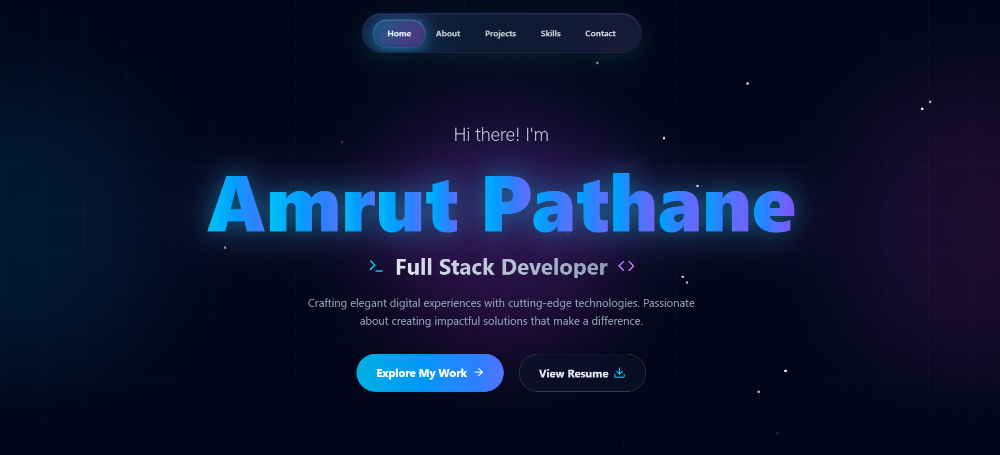

# 🌟 Portfolio Website - Amrut Pathane

A modern, responsive portfolio website showcasing my projects, skills, and experience as a Full Stack Developer. Built with React, Vite, and Tailwind CSS, featuring stunning animations, glassmorphism design, and a fully functional contact form.



## 🚀 Live Demo

Visit the live website: [https://amrutpathane.me](https://amrutpathane.me)

## ✨ Features

### 🎨 Modern Design
- **Glassmorphism UI** with frosted glass effects
- **Gradient Theme** - Cyan → Blue → Purple color scheme
- **Floating Particles** background animation
- **Smooth Animations** with GPU acceleration for optimal performance

### 📱 Sections
- **Home** - Dynamic hero section with animated name and CTA buttons
- **About** - Personal introduction with gradient orbs
- **Projects** - Showcase of 5+ projects with live demos and GitHub links
- **Skills** - Technical expertise with animated progress bars
- **Contact** - Fully functional contact form with EmailJS integration

### 🛠️ Technical Features
- Responsive design (mobile, tablet, desktop)
- Smooth scrolling navigation
- Performance-optimized animations
- Project images with hover effects
- Social media integration
- Email contact form
- SEO-friendly meta tags

## 🛠️ Tech Stack

### Frontend
- **React 19** - UI framework
- **Vite** - Build tool and dev server
- **Tailwind CSS** - Utility-first CSS framework
- **Framer Motion** - Animation library
- **React Scroll** - Smooth scrolling
- **Lucide React** - Icon library

### Backend Integration
- **EmailJS** - Contact form email service

## 📂 Project Structure

```
portfolio/
├── public/
│   ├── assets/
│   │   └── projects/          # Project screenshots
│   ├── favicon.png            # Website favicon
│   └── resume.pdf             # Resume file
├── src/
│   ├── components/
│   │   ├── Navbar.jsx         # Navigation bar
│   │   ├── Home.jsx           # Hero section
│   │   ├── About.jsx          # About section
│   │   ├── Projects.jsx       # Projects showcase
│   │   ├── Skills.jsx         # Skills & expertise
│   │   └── Contact.jsx        # Contact form
│   ├── App.jsx                # Main app component
│   ├── main.jsx               # Entry point
│   └── index.css              # Global styles
├── index.html                 # HTML template
├── package.json               # Dependencies
├── tailwind.config.js         # Tailwind configuration
├── vite.config.js             # Vite configuration
└── README.md                  # This file
```

## 📊 Performance

- **GPU-accelerated animations** for smooth transitions
- **Optimized images** for fast loading
- **Responsive design** for all devices

## 🤝 Connect With Me

- **GitHub:** [Amrut00](https://github.com/Amrut00)
- **LinkedIn:** [Amrut Pathane](https://www.linkedin.com/in/amrut-pathane/)
- **Email:** pathaneamrut@gmail.com

## 🙏 Acknowledgments

- Design inspiration from modern portfolio trends
- Icons by [Lucide](https://lucide.dev/)
- Animations by [Framer Motion](https://www.framer.com/motion/)
- Email service by [EmailJS](https://www.emailjs.com/)

---

⭐ **Star this repo if you found it helpful!**

Made with ❤️ by Amrut Pathane
